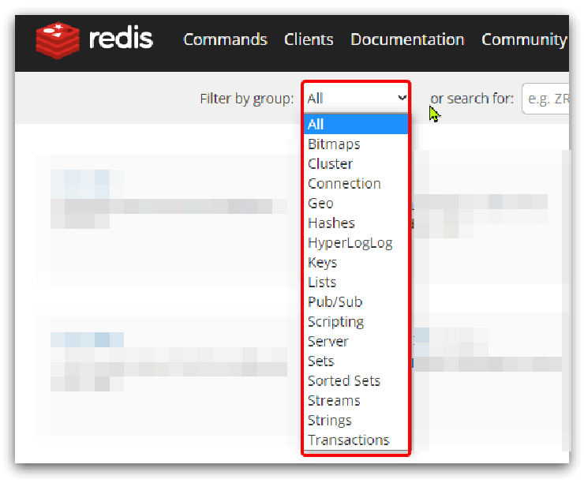
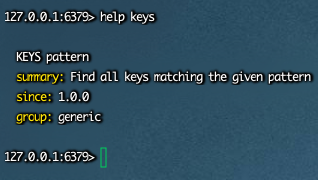
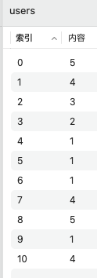

### 1 Redis数据结构介绍

Redis是一个key-value的数据库，key一般是String类型，不过value的类型多种多样：


**贴心小建议：命令不要死记，学会查询就好啦**

Redis为了方便我们学习，将操作不同数据类型的命令也做了分组，在官网（ https://redis.io/commands ）可以查看到不同的命令：



当然我们也可以通过Help命令来帮助我们去查看命令


### 2.Redis通用命令

通用指令是部分数据类型的，都可以使用的指令，常见的有：

- KEYS：查看符合模板的所有key
- DEL：删除一个指定的key
- EXISTS：判断key是否存在
- EXPIRE：给一个key设置有效期，有效期到期时该key会被自动删除
- TTL：查看一个KEY的剩余有效期

通过help [command] 可以查看一个命令的具体用法，例如：




- Keys

```sh
127.0.0.1:6379> keys *
1) "key1"
2) "mykey"
3) "key2"
127.0.0.1:6379> keys a*
(empty list or set)
# 查看a开头的key
127.0.0.1:6379> keys my*
1) "mykey"
127.0.0.1:6379> 
```

**贴心小提示：在生产环境下，不推荐使用keys 命令，因为这个命令在key过多的情况下，效率不高**

- Del

```sh
127.0.0.1:6379> del key1	# 删除单个
(integer) 1
127.0.0.1:6379> keys *		#成功删除
1) "mykey"
2) "key2"
127.0.0.1:6379> 
127.0.0.1:6379> 
127.0.0.1:6379> MSET k1 v1 k2 v2 k3 v3	#批量添加
OK
127.0.0.1:6379> keys *
1) "mykey"
2) "k1"
3) "k3"
4) "k2"
5) "key2"
127.0.0.1:6379> del k1 k2 k3 k4 k5
(integer) 3		#表示只成功删除3个
127.0.0.1:6379> keys *
1) "mykey"
2) "key2"
127.0.0.1:6379> 
```


- Exists

```sh
127.0.0.1:6379> help EXISTS

  EXISTS key [key ...]
  summary: Determine if a key exists
  since: 1.0.0
  group: generic

127.0.0.1:6379> EXISTS mykey
(integer) 1
127.0.0.1:6379> EXISTS key1
(integer) 0
127.0.0.1:6379> keys *
1) "mykey"
2) "key2"
127.0.0.1:6379> 
```


- Expire

**贴心小提示**：内存非常宝贵，对于一些数据，我们应当给他一些过期时间，当过期时间到了之后，他就会自动被删除~

```sh
127.0.0.1:6379> EXPIRE age 20
(integer) 1
127.0.0.1:6379> ttl age
(integer) 17
127.0.0.1:6379> ttl age
(integer) 16
127.0.0.1:6379> ttl age
(integer) 14
127.0.0.1:6379> ttl age
(integer) 9
127.0.0.1:6379> ttl age
(integer) -2		# key过期了，查询出来的就是-2
127.0.0.1:6379> keys *
1) "mykey"
2) "key2"
127.0.0.1:6379> set age 10	#如果没有设置过期时间
OK
127.0.0.1:6379> ttl age
(integer) -1	#-1表示永久有效
127.0.0.1:6379> 
```

### 3.Redis命令-String命令

String类型，也就是字符串类型，是Redis中最简单的存储类型。

其value是字符串，不过根据字符串的格式不同，又可以分为3类：

* string：普通字符串
* int：整数类型，可以做自增.自减操作
* float：浮点类型，可以做自增.自减操作


String的常见命令有：

* SET：添加或者修改已经存在的一个String类型的键值对
* GET：根据key获取String类型的value
* MSET：批量添加多个String类型的键值对
* MGET：根据多个key获取多个String类型的value
* INCR：让一个整型的key自增1
* INCRBY:让一个整型的key自增并指定步长，例如：incrby num 2 让num值自增2
* INCRBYFLOAT：让一个浮点类型的数字自增并指定步长
* SETNX：添加一个String类型的键值对，前提是这个key不存在，否则不执行
* SETEX：添加一个String类型的键值对，并且指定有效期

**贴心小提示**：以上命令除了INCRBYFLOAT 都是常用命令

- Set与Get：通过key不存在则是新增，如果存在就是修改

```sh
127.0.0.1:6379> set name Rose	#原来不存在
OK
127.0.0.1:6379> get name
"Rose"
127.0.0.1:6379> set name Jack	#原来存在，就是修改
OK
127.0.0.1:6379> get name
"Jack"
127.0.0.1:6379> keys *
1) "mykey"
2) "age"
3) "name"
4) "key2"
127.0.0.1:6379> 
```

- Mest与Mget

```sh
127.0.0.1:6379> mset k1 v1 k2 v2 k3 v3
OK
127.0.0.1:6379> mget name age k1 k2 k3
1) "Jack"
2) "10"
3) "v1"
4) "v2"
5) "v3"
127.0.0.1:6379> 
```

- INCR和INCRBY和DECY

```shell
127.0.0.1:6379> get age
"10"
127.0.0.1:6379> incr age
(integer) 11
127.0.0.1:6379> get age
"11"
127.0.0.1:6379> incrby age
(error) ERR wrong number of arguments for 'incrby' command
127.0.0.1:6379> incrby age 2
(integer) 13
127.0.0.1:6379> incrby age 2
(integer) 15
127.0.0.1:6379> incrby age -1
(integer) 14
127.0.0.1:6379> incrby age -2
(integer) 12
127.0.0.1:6379> DECR age
(integer) 11
127.0.0.1:6379> get age
"11"
127.0.0.1:6379> 
```

- SETNX

```shell
127.0.0.1:6379> help SETNX

  SETNX key value
  summary: Set the value of a key, only if the key does not exist
  since: 1.0.0
  group: string
#如果存在就不会对该数据进行操作
127.0.0.1:6379> set name Jack
OK
127.0.0.1:6379> setnx name lisi
(integer) 0
127.0.0.1:6379> get name
"Jack"
127.0.0.1:6379> setnx name2 lisi
(integer) 1
127.0.0.1:6379> get nane2
(nil)
127.0.0.1:6379> get name2
"lisi"
127.0.0.1:6379> 

```


### 4.Redis命令-Key的层级结构

Redis没有类似MySQL中的Table的概念，我们该如何区分不同类型的key呢？

例如，需要存储用户.商品信息到redis，有一个用户id是1，有一个商品id恰好也是1，此时如果使用id作为key，那就会冲突了，该怎么办？

我们可以通过给key添加前缀加以区分，不过这个前缀不是随便加的，有一定的规范：

Redis的key允许有多个单词形成层级结构，多个单词之间用':'隔开，格式如下：


这个格式并非固定，也可以根据自己的需求来删除或添加词条。

例如我们的项目名称叫 heima，有user和product两种不同类型的数据，我们可以这样定义key：

- user相关的key：**heima:user:1**

- product相关的key：**heima:product:1**

如果Value是一个Java对象，例如一个User对象，则可以将对象序列化为JSON字符串后存储：

| **KEY**         | **VALUE**                                 |
| --------------- | ----------------------------------------- |
| heima:user:1    | {"id":1, "name": "Jack", "age": 21}       |
| heima:product:1 | {"id":1, "name": "小米11", "price": 4999} |

一旦我们向redis采用这样的方式存储，那么在可视化界面中，redis会以层级结构来进行存储，形成类似于这样的结构，更加方便Redis获取数据


### 5.Redis命令-Hash命令

Hash类型，也叫散列，其value是一个无序字典，类似于Java中的HashMap结构。

String结构是将对象序列化为JSON字符串后存储，当需要修改对象某个字段时很不方便：


Hash结构可以将对象中的每个字段独立存储，可以针对单个字段做CRUD：


**Hash类型的常见命令**

- HSET key field value：添加或者修改hash类型key的field的值

- HGET key field：获取一个hash类型key的field的值

- HMSET：批量添加多个hash类型key的field的值

- HMGET：批量获取多个hash类型key的field的值

- HGETALL：获取一个hash类型的key中的所有的field和value
- HKEYS：获取一个hash类型的key中的所有的field
- HINCRBY:让一个hash类型key的字段值自增并指定步长
- HSETNX：添加一个hash类型的key的field值，前提是这个field不存在，否则不执行

**贴心小提示**：哈希结构也是我们以后实际开发中常用的命令哟

* Hset和Hget

```sh
127.0.0.1:6379> HSET heima:user:3 name Lucy	#大Key是heima:user:3 小Key是name，小value是Lucy
(integer) 1
127.0.0.1:6379> HSET heima:user:3 age 114 #如果不存在的数据，则是新增
(integer) 1
127.0.0.1:6379> HSET heima:user:3 age 17	#如果存在的数据则是修改
(integer) 0
127.0.0.1:6379> HGET heima:user:3 name
"Lucy"
127.0.0.1:6379> HGET heima:user:3 age
"17"
127.0.0.1:6379> 
```

- HMSET和HMGET

```sh
127.0.0.1:6379> HMSET heima:user:4 name HanMeiMei
OK
127.0.0.1:6379> HMSET heima:user:4 name HanMeiMei age 20 sex man
OK
127.0.0.1:6379> HMGET heima:user:4 name age sex
1) "HanMeiMei"
2) "20"
3) "man"
127.0.0.1:6379> 
```

- HGETALL

```shell
127.0.0.1:6379> HGETALL heima:user:4
1) "name"
2) "HanMeiMei"
3) "age"
4) "20"
5) "sex"
6) "man"
127.0.0.1:6379> 
```

- HKEYS和HVALS

```shell
127.0.0.1:6379> HKEYS heima:user:3	#获取所有的键
1) "name"
2) "age"
127.0.0.1:6379> HVALS heima:user:3	#获取所有的值
1) "Lucy"
2) "17"
127.0.0.1:6379> 
```

- HINCRBY

```sh
127.0.0.1:6379> HINCRBY heima:user:3 age 2
(integer) 19
127.0.0.1:6379> HINCRBY heima:user:3 age 2
(integer) 21
127.0.0.1:6379> HINCRBY heima:user:3 age -2
(integer) 19
127.0.0.1:6379> HINCRBY heima:user:3 age 10
(integer) 29
127.0.0.1:6379> 
```

- HSETNX

前提是field不存在，否则不执行

```sh
127.0.0.1:6379> HSETNX heima:user:4 sex women
(integer) 0
127.0.0.1:6379> HSETNX heima:user:3 sex women
(integer) 1
127.0.0.1:6379> HGETALL heima:user:3
1) "name"
2) "Lucy"
3) "age"
4) "29"
5) "sex"
6) "women"
127.0.0.1:6379> 
```


### 6.Redis命令-List命令

Redis中的List类型与Java中的LinkedList类似，可以看做是一个双向链表结构。既可以支持正向检索和也可以支持反向检索。

特征也与LinkedList类似：

* 有序
* 元素可以重复
* 插入和删除快
* 查询速度一般

常用来存储一个有序数据，例如：朋友圈点赞列表，评论列表等。

**List的常见命令有：**

- LPUSH key element ... ：向列表左侧插入一个或多个元素
- LPOP key：移除并返回列表左侧的第一个元素，没有则返回nil
- RPUSH key element ... ：向列表右侧插入一个或多个元素
- RPOP key：移除并返回列表右侧的第一个元素
- LRANGE key star end：返回一段角标范围内的所有元素
- BLPOP和BRPOP：与LPOP和RPOP类似，只不过在没有元素时等待指定时间，而不是直接返回nil


- LPUSH和RPUSH

```sh
127.0.0.1:6379> LPUSH users 1 2 3 4 5
(integer) 5
127.0.0.1:6379> RPUSH users 1 1 4 5 1 4 
(integer) 11
127.0.0.1:6379> 
```



* LPOP和RPOP

```java
127.0.0.1:6379> LPOP users
"3"
127.0.0.1:6379> RPOP users
"6"
```

* LRANGE

```java
127.0.0.1:6379> LRANGE users 1 2
1) "1"
2) "4"
```

### 7.Redis命令-Set命令

Redis的Set结构与Java中的HashSet类似，可以看做是一个value为null的HashMap。因为也是一个hash表，因此具备与HashSet类似的特征：

* 无序
* 元素不可重复
* 查找快
* 支持交集.并集.差集等功能

**Set类型的常见命令**

* SADD key member ... ：向set中添加一个或多个元素
* SREM key member ... : 移除set中的指定元素
* SCARD key： 返回set中元素的个数
* SISMEMBER key member：判断一个元素是否存在于set中
* SMEMBERS：获取set中的所有元素
* SINTER key1 key2 ... ：求key1与key2的交集
* SDIFF key1 key2 ... ：求key1与key2的差集
* SUNION key1 key2 ..：求key1和key2的并集


**具体命令**

```java
127.0.0.1:6379> SADD s1 1 1 4 5 1 4
(integer) 3		//自动去重
127.0.0.1:6379> SMEMBERS s1	
1) "1"
2) "4"
3) "5"
127.0.0.1:6379> SREM s1 1
(integer) 1
127.0.0.1:6379> SISMEMBER s1 1
(integer) 0
127.0.0.1:6379> SISMEMBER s1 4
(integer) 1
127.0.0.1:6379> SCARD s1
(integer) 2
127.0.0.1:6379> 
```

**案例**

* 将下列数据用Redis的Set集合来存储：
* 张三的好友有：李四.王五.赵六
* 李四的好友有：王五.麻子.二狗
* 利用Set的命令实现下列功能：
* 计算张三的好友有几人
* 计算张三和李四有哪些共同好友
* 查询哪些人是张三的好友却不是李四的好友
* 查询张三和李四的好友总共有哪些人
* 判断李四是否是张三的好友
* 判断张三是否是李四的好友
* 将李四从张三的好友列表中移除

```java
127.0.0.1:6379> SADD zs lisi wangwu zhaoliu
(integer) 3
    
127.0.0.1:6379> SADD ls wangwu mazi ergou
(integer) 3
    
127.0.0.1:6379> SCARD zs
(integer) 3
    
127.0.0.1:6379> SINTER zs ls
1) "wangwu"
    
127.0.0.1:6379> SDIFF zs ls
1) "zhaoliu"
2) "lisi"
    
127.0.0.1:6379> SUNION zs ls
1) "wangwu"
2) "zhaoliu"
3) "lisi"
4) "mazi"
5) "ergou"
    
127.0.0.1:6379> SISMEMBER zs lisi
(integer) 1
    
127.0.0.1:6379> SISMEMBER ls zhangsan
(integer) 0
    
127.0.0.1:6379> SREM zs lisi
(integer) 1
    
127.0.0.1:6379> SMEMBERS zs
1) "zhaoliu"
2) "wangwu"
```

### 8.Redis命令-SortedSet类型

Redis的SortedSet是一个可排序的set集合，与Java中的TreeSet有些类似，但底层数据结构却差别很大。SortedSet中的每一个元素都带有一个score属性，可以基于score属性对元素排序，底层的实现是一个跳表（SkipList）加 hash表。

SortedSet具备下列特性：

- 可排序
- 元素不重复
- 查询速度快

因为SortedSet的可排序特性，经常被用来实现排行榜这样的功能。


SortedSet的常见命令有：

- ZADD key score member：添加一个或多个元素到sorted set ，如果已经存在则更新其score值
- ZREM key member：删除sorted set中的一个指定元素
- ZSCORE key member : 获取sorted set中的指定元素的score值
- ZRANK key member：获取sorted set 中的指定元素的排名
- ZCARD key：获取sorted set中的元素个数
- ZCOUNT key min max：统计score值在给定范围内的所有元素的个数
- ZINCRBY key increment member：让sorted set中的指定元素自增，步长为指定的increment值
- ZRANGE key min max：按照score排序后，获取指定排名范围内的元素
- ZRANGEBYSCORE key min max：按照score排序后，获取指定score范围内的元素
- ZDIFF.ZINTER.ZUNION：求差集.交集.并集

注意：所有的排名默认都是升序，如果要降序则在命令的Z后面添加REV即可，例如：

- **升序**获取sorted set 中的指定元素的排名：ZRANK key member
- **降序**获取sorted set 中的指定元素的排名：ZREVRANK key memeber


